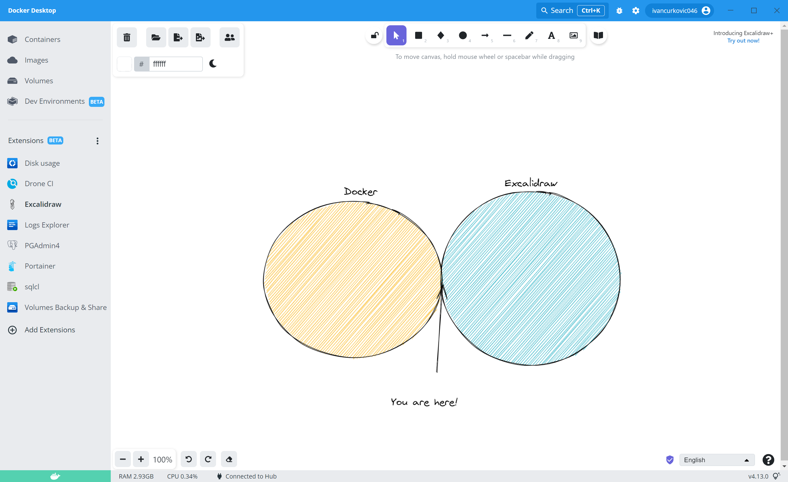

# Introdution

This is the minimal open source project to host Excalidraw as a Docker Extension.




## How to install?

```
docker extension install ivancurkovic046/excalidraw-docker-extension:latest
``` 


## How to build from source?
```
docker build . --tag=ivancurkovic046/excalidraw-docker-extension:latest
```

## Links
- https://github.com/excalidraw/excalidraw Excalidraw
- https://docs.docker.com/desktop/extensions/ Docker Extensions